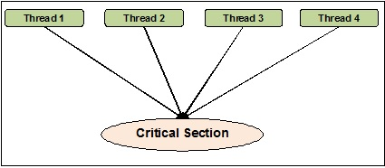

# 01 Prepare: Course Introduction

# Overview

The first week of the course is an introduction to the topic of parallelism and concurrency.  Since this course uses the programming language Python for assignments, we will spend some of the first week reviewing the Python language and Python packages that we will be using.

Please carefully read the syllabus so you will know how to best allocate your time and focus your efforts.  The Syllabus is found in Canvas (I-Learn).


# Preparation Material

This course assumes that you have programmed in Python using classes. Please refer to [Software Requirements](../overview/software.md) for details and a review of Python.


# Course Introduction

**What is concurrency?**

> In computer science, concurrency is the ability of different parts or units of a program, algorithm, or problem to be executed out-of-order or in partial order, without affecting the final outcome. This allows for parallel execution of the concurrent units, which can significantly improve overall speed of the execution in multi-processor and multi-core systems. In more technical terms, concurrency refers to the decomposability property of a program, algorithm, or problem into order-independent or partially-ordered components or units

Example of concurrency are:
- Chrome Browser
- Website server node.js [website](https://nodejs.org/en/)
- An Operating System running on a 1 cpu core computer


-- [Definition of Concurrency](https://en.wikipedia.org/wiki/Concurrency_(computer_science))


**What is parallelism?**

> Parallel computing is a type of computation where many calculations or the execution of processes are carried out simultaneously. Large problems can often be divided into smaller ones, which can then be solved at the same time. 

Example of parallelism are:
- Graphical Cards (GPU)
- long numeric calculations
- Computer games
- Compression software
- Operating System running on many cpu cores

-- [Definition of Parallelism](https://en.wikipedia.org/wiki/Parallel_computing)


The main difference between concurrency and parallelism is that parallelism has processes that are running simultaneously, while concurrency only has one process executing at one time.


## I/O Bound -VS- CPU Bound

Researchers have studied software and note that there are generally two different stages that programs switches many times during their execution.  They are Input/Output bound and cpu bound.

**I/O Bound** 

 [I/O Bound](https://en.wikipedia.org/wiki/I/O_bound) refers to a condition in which the time it takes to complete a computation is determined principally by the period spent waiting for input/output operations to be completed.  For example: Waiting for the user to enter something, file access (reading and writing), Internet requests, etc...

In Python, we'll be using threads for I/O bound problems.

**CPU Bound** 

[CPU Bound](https://en.wikipedia.org/wiki/CPU-bound) refers to a situation when the time for a task to complete is determined principally by the speed of the central processor or the number of processors.  Once a program has all of the data it needs to do work, it will be spending it's time using the CPU.

In Python, we'll be using processes for CPU bound programs.

Quote from https://rednafi.github.io/digressions/python/2020/04/21/python-concurrent-futures.html

> In Python, if the task at hand is I/O bound, you can use use standard library’s `threading` module or if the task is CPU bound then `multiprocessing` module can be your friend. These `threading` and `multiprocessing` APIs give you a lot of control and flexibility but they come at the cost of having to write relatively low-level verbose code that adds extra layers of complexity on top of your core logic. Sometimes when the target task is complicated, it’s often impossible to avoid complexity while adding concurrency. However, a lot of simpler tasks can be made concurrent without adding too much extra overhead.

We will be focusing on the threading module for the first 2 weeks of the course. Then, multi-processes for the next 3 weeks.

## Threading Package

For the first two weeks of the course, we are learning how to add threads to our programs.  We will be using the threading package.  It is included in your Python program using the following:

```python
import threading
```

## What is a thread?

This quote is from: [Thread (computing)](https://en.wikipedia.org/wiki/Thread_(computing))
> In computer science, a thread of execution is the smallest sequence of programmed instructions that can be managed independently by a scheduler, which is typically a part of the operating system. The implementation of threads and processes differs between operating systems, but in most cases a thread is a component of a process. Multiple threads can exist within one process, executing concurrently and sharing resources such as memory, while different processes do not share these resources. In particular, the threads of a process share its executable code and the values of its dynamically allocated variables and non-thread-local global variables at any given time.

In the previous Python program that you wrote, there was always one thread running in your program.  This is called the `main thread`.  All programs have this main thread and only uses one CPU core on a computer.  With computers now having 8, 16, 32, etc... cores, we need to write programs that can use those multiple cores.

### Timer() function in the threading package

The `timer()` function allows you to run a function in the future by indicating the amount of time in seconds.  The following code will create a timer that will call the function `display_hello()` in 3 seconds when the thread is started.

In the statement `thread = threading.Timer(3.0, display_hello)`, the function `display_hello` is passed to the Timer.  There are no `()` used for a function that is passed as an argument to a function.

```python
import threading

def display_hello():
    print ("Hello, World!")

print('Before the thread')
thread = threading.Timer(3.0, display_hello)
thread.start()
print('After the thread - End of program')
```

Here is the output of the above program.  Notice that the text `Hello World` was displayed after the text `After the thread - End of program`.  The reason for this is that the main thread will continue to run after it starts the timer (ie., `thread.start()`)  The program ends when the main thread and the timer are finished.

```
Before the thread
After the thread - End of program
Hello, World!
```

### Thread Example

Here is an example of creating, starting and ending a thread.  We will be going in more detail in next lesson.

```python
import logging
import threading
import time

def thread_function(name, sleep_time):
    """This is the function the thread will run"""
    print(f'Thread "{name}": starting')
    time.sleep(sleep_time)
    print(f'Thread "{name}": finishing')

if __name__ == '__main__':
    print('Main    : before creating thread')

    # Create a thread.  This doesn't start it, just it's creation
    # The args argument allow the main code to pass arguments to the
    # thread.
    # we DON'T want any global variables in this case.
    # Note: if you are wondering about the ',' after 'Sleep Function',
    # please review tuples in Python.
    t = threading.Thread(target=thread_function, args=('Sleep Function', 2))

    print('Main    : before running thread')
    # The code here in main will start the thread and then keep
    # executing. It will not wait for the thread to return. 
    t.start()

    print('Main    : wait for the thread to finish')
    # Joining a thead back to the main thread is waiting for the
    # created thread to finish.
    t.join()

    print('Main    : all done')
```

Program output

```text
Main    : before creating thread
Main    : before running thread
Thread "Sleep Function": starting
Main    : wait for the thread to finish
Thread "Sleep Function": finishing
Main    : all done
```

### Starting and waiting for it to finish

There are two methods used for starting and waiting for class threads.

**start()**

This is a non-blocking function call.  Start() will start the thread running and will return to the caller.  It doesn't wait for the thread to execute.  In designing programs that use threads, there are a few guiding principles:

1. Don't use sleep() to control the order of when threads run.  The course uses `sleep()` in some assignments and team activities just to slow execution down to simulate the thread doing meaningful work.
2. When you start a group of threads, you as a programmer should not assume any order of execution of these threads.  For example: if you create two threads (t1 and t2), and start them in the order of `t1.start()` then `t2.start()`.  You should not assume that `t1` is going to run first before `t2`.

**join()**

This is a blocking function call.  Join() will wait until that thread is finished executing.  If the thread is still busy doing something, then join() will not return until it's finished.  If the thread never finishes, then your program will hang (deadlock) on `join()`.

## The importance of `__main__`

In Python, there are special run-time variables that are available to programmers.  Python programs don't need a "main" function if there is only one file in your program.  Where you have multiple files, Python needs to know which file contains the "main" code.  The variable `__name__` is used to denote if a file is the main file. [More details on `__main__`](https://docs.python.org/3/library/__main__.html)

[Video on why \_\_name\_\_ is important](https://www.youtube.com/watch?v=lOeIDvyRUQs)


```python
if __name__ == "__main__":
    # execute only if run as a script (ie., the main file)
    main()
```

When writting multi-processor programs that have multiple files, you must test for `if __name_ == "__main__":` or else Python will start running your program from different files as each process is created.

Note: the function `dir()` can display the current builtin functions in your program.

```python
> print(dir())

['__annotations__', '__builtins__', '__cached__', '__doc__', '__file__', '__loader__', '__name__', '__package__', '__spec__']
```

## Differences between threads and processes

### Python Global Interpreter (GIL)

Before we can talk about threads and processes, we need to understand the Python Global Interpreter Lock or GIL. It is a mutex (or a lock) that allows only one thread to hold the control of the Python interpreter.

This means that only one thread can be in a state of execution at any one time. If you write single-threaded programs, then the GIL has no impact.  However, when writing parallel and concurrent programs, it is critical to understand it.

### Process

In terms of computer systems, a "process" is a program that has been loaded by the operating system and is running.  It contains 1 to N threads.  All processes contain 1 thread that is called the main thread.  The operating system will start that main thread for the process and when that main thread ends, the process ends. [Process (computing)](https://en.wikipedia.org/wiki/Process_(computing))


### Thread

A thread is the smallest unit managed by the operating system that is scheduled to run on the CPU. [Thread (computing)](https://en.wikipedia.org/wiki/Thread_(computing))


### How Python handles threads and processes

Because of the GIL, all threads are running concurrently in your program.  The operating system will give each thread a little time slice on the CPU and switch between them quickly giving the appearance that they are all running at the same time.

When you create a process in Python, each process will contain their own instance of a GIL.  This allows each process to run in parallel on the computer.


### I/O and CPU Bound code

Computer programs have been analyzed for many years and researchers have noticed that during the life of a running process, the process will **switch** between waiting for I/O (ie., user input, Internet requests, file accesses) and running instructions on the CPU (ie., calculations).

**I/O Bound**

> In computer science, I/O bound refers to a condition in which the time it takes to complete a computation is determined principally by the period spent waiting for input/output operations to be completed. This is the opposite of a task being CPU bound. This circumstance arises when the rate at which data is requested is slower than the rate it is consumed or, in other words, more time is spent requesting data than processing it.  [I/O Bound Webpage](https://en.wikipedia.org/wiki/I/O_bound)

In Python, threads are used for I/O Bound problems

**CPU Bound**

> In computer science, a computer is CPU-bound (or compute-bound) when the time for it to complete a task is determined principally by the speed of the central processor: processor utilization is high, perhaps at 100% usage for many seconds or minutes. [CPU Bound Webpage](https://en.wikipedia.org/wiki/CPU-bound)

In Python, processes are used for CPU Bound problems

**Summary**

|   | thread  | process  |
|---|---|---|
| Allow sharing of memory  | Yes  | No  |
| Allow sharing of files handles  | Yes  | No  |
| Concurrent  | Yes  | Yes  |
| Parallel  | No  | Yes  |
| Quick To Create | Yes  | No |
| New instance of GIL created | No  | Yes |
| Good for I/O Bound | Yes  | No |
| Good for CPU Bound | No  | Yes |

## Creating a Thread

Coding example of creating a child thread.

```python
import threading
import time

def thread_function(name):
    """This is the function the thread will run"""
    print(f'Thread "{name}": starting')
    time.sleep(2)
    print(f'Thread "{name}": finishing')

if __name__ == '__main__':
    print('Main    : before creating thread')

    t = threading.Thread(target=thread_function, args=('Bob',))

    print('Main    : before running thread')
    t.start()

    print('Main    : wait for the thread to finish')
    t.join()

    print('Main    : all done')
```

Let's look again at the coding example above.  There are three main steps:

1. Create a thread and give the thread a function to execute.

Creation of a thread is handled by called the `Thread()` function in the `threading` module.  The created thread is called the child thread and the thread that creates it is called the parent.  (In the example below, it's the main thread creating the thread `t`)

```python
t = threading.Thread(target=thread_function, args=('Bob',))
```

**target** is used to pass the reference of the function you want to thread to execute.

**args** is used to pass information to the threaded function.  Note that this is a Python tuple.  Tuples that only contain one item in them need to be created with the extra `,`.  The number of arguments in your threaded function needs to match the count of the tuple.

2. Start the thread.

A thread doesn't start to execute until you call the start() method.  This allows you to create all of the threads required for your task and then start them when needed.

```python
t.start()
```

3. Wait for the thread to finish.

The parent thread has full control of any child threads that are created and can wait for the child threads to finish. The function `join()` is used for this purpose.  Think of the parent thread waiting for the child threads to "re-join" the parent.

```python
t.join()
```

Program output

```text
Main    : before creating thread
Main    : before running thread
Thread "Bob": starting
Main    : wait for the thread to finish
Thread "Bob": finishing
Main    : all done
```

Here is an example of creating 3 threads all using the same function.

```python
import threading
import time

def thread_function(name, sleep_time):
    """This is the function the thread will run"""
    print(f'Thread "{name}": starting')
    time.sleep(sleep_time)
    print(f'Thread "{name}": finishing')

if __name__ == '__main__':
    print('Main    : before creating thread')

    # Create a threads
    t1 = threading.Thread(target=thread_function, args=('Bob', 3))
    t2 = threading.Thread(target=thread_function, args=('Jim', 2))
    t3 = threading.Thread(target=thread_function, args=('Mary', 1))

    print('Main    : before running thread')

    t1.start()
    t2.start()
    t3.start()

    print('Main    : wait for the thread to finish')

    t1.join()
    t2.join()
    t3.join()

    print('Main    : all done')
```

Output

```
Main    : before creating thread
Main    : before running thread
Thread "Bob": starting
Thread "Jim": starting
Thread "Mary": starting
Main    : wait for the thread to finish
Thread "Mary": finishing
Thread "Jim": finishing
Thread "Bob": finishing
Main    : all done
```

## Critical Sections

Although the GIL will run threads concurrently (ie., one at a time switching quickly between them), you still might need to protect shared data between threads.

For Example: let's say that you have threads that are using a file as a counter (I know that this is a made up example). The file will contain an integer that is the count.

```python
def thread_func(filename, count):
    f = open(filename, 'w')
    f.write(count)
    f.close()
```

This works great in a single-threaded program.  But when we have, say two threads, it can become a problem. Remember, you as the programmer can't control which thread runs on the cpu, or when the operating system will switch to another thread and for how long they will run when they have the CPU.

| Thread A | Thread B |
|---|---|
| f = open(filename, 'w') |  |
| f.write(count) |  |
| OS switchs to thread B ==> |  |
|  | f = open(filename, 'w') |
|  | Program crashes because the file is locked by thread A |

In the table above, Thread `B` will crash when trying to open the file in write only mode.  This is because Thread `A` never finished closing the file before Thread `B` started.

Python allows you to denote part of your code as a critical section.  A critical section is code that only allows 1 thread to execute at a time.  That thread will start and finish executing the code before any other thread can execute it.  [Critical Section webpage](https://en.wikipedia.org/wiki/Critical_section)


In the figure, 4 threads are tyring to get into the critical section.




To create a critical section, we will be using the Lock() method in the `threading` module. Calls to `acquire()` and `release()` need to match.  If your code doesn't release a lock, then your program will hang on the next call to `acquire()`.  This is called Dead Lock.

You will slow your program if you use too many locks or use them when other solutions are available that don't require locks.

```python
lock = threading.Lock()

def thread_func(filename, count):
    # acquire the lock before entering the critical section
    # If another thread has the lock, this thread will wait
    # until it's released.
    lock.acquire()
    
    # Do your stuff.  Only 1 thread is running this code
    f = open(filename, 'w')
    f.write(count)
    f.close()

    # release the lock.  If you fail to release the lock,
    # the next thread that tried to acquire the lock will
    # wait forever since the release will never happen.
    lock.release()

```


## Deamon Threads

Python also has deamon threads.  (Note, we are not using them in the course).  They are mentioned here in case you read about them in your research. 

> A Daemon Thread is a type of thread that can run independently in the background. These kinds of threads execute independently of the main thread. So these are called non-blocking threads.

The issue with deamon threads is that they are abruptly stopped at shutdown.  Their resources (memory, files, database transactions, etc.) may not be released properly.


> **From the Instructor**
> 
> Reading is key to doing well in this course.  You will be required to read the provided material each week.  Take your time and read the material more than once if you don't understand it the first time.
