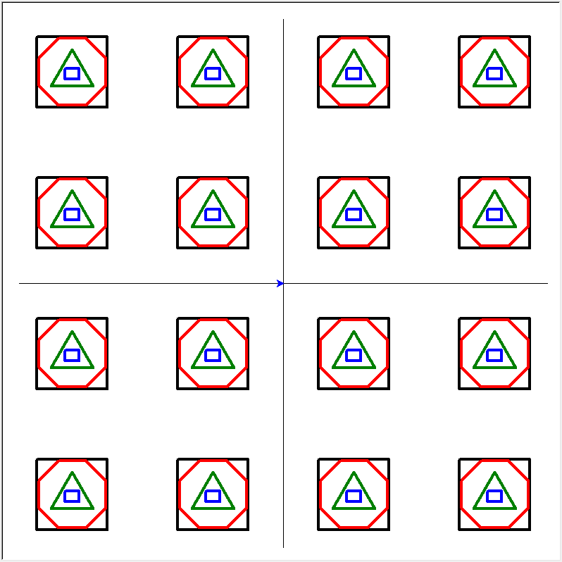

# 01 Prove: Drawing Shapes 

# Overview

You're first assignment is to draw shapes on the screen. When you download the file `assignment.py`, and run it.  It will create the following drawing on the screen.  Your task is to use threads for the drawing.

Image of the drawing shapes generated by the assignment.




## Instructions

1. Download `assignment.py` and `cse251turtle.py` from the `week01/assignment` folder in Github.  Create a folder on your computer that will contain these files. Read the header in the `assignment.py` file. Here is [GutHub Assignment's Folder](assignment)
2. Open that folder that you created in VSCode.  This is important for the `assignment.py` file to find `cse251turtle.py`.  Here are two methods of opening a folder in VSCode.
	- On the Visual Studio menu bar, choose `File > Open > Folder`, and then browse to the code location.
	- On the context (right-click) menu of a folder containing code, choose the Open in Visual Studio command.

3. Run `assignment.py`.  It will draw the shapes in the image above.  These shapes are drawn without using threads.  Each type of shape is drawn one at a time - one after the other.  Here are the functions used for drawing.

	```python
	draw_squares(tur)
	draw_circles(tur)
	draw_triangles(tur)
	draw_rectangles(tur)
	```

4. Look for `TODO` comments in the program.  You will be creating and executing 4 threads.  Each thread will call one of the `draw_?(tur)` functions above.  (I.e. one thread calls `draw_squares()`, another calls `draw_circles()`, etc...).  Your goal is not to draw the shapes in the same order as the non-threaded function, but to end up with the same results.  The threads must be running concurrenctly and take turns drawing their shape.  For example, you should see some (not all) squares drawn, then circles, then rectangles, then squares again, then triangles, etc.  You can create extra functions if required.
5. You should not change any of the Log statements in the assignment. (See below section on the Logger class)

## CSE 251 Logger

This assignment uses the Log class found in `cse251.py`. Refer to the [log class documentation](../overview/cse251_code.md)

The assignment program will creating the following logging information.  Here is the output from the assignment program before adding threads.

```text
14:03:45| ---------------------------------------------------------------
14:03:45| Start Drawing No Threads
14:03:50| All drawing commands have been created = 4.98925690
14:03:50| Number of Drawing Commands: 983
14:04:06| Total drawing time = 20.81664890
14:04:06| --------------------------------------------------------------
14:04:06| Start Drawing With Threads
14:04:06| All drawing commands have been created = 0.00000520
14:04:06| Number of Drawing Commands: 20
14:04:06| Total drawing time = 0.32776570
```

## Rubric

Assignments are not accepted late. Instead, you should submit what you have completed by the due date for partial credit.
The Assignment will be graded in broad categories according to the following:

| Grade | Description |
|-------|-------------|
| 0% | Nothing submitted or no meaningful attempt made |
| 50% | Meaningful attempt made or doesn't compile |
| 75% | Developing (but significantly deficient) |
| 85% | Slightly deficient |
| 93% to 100% | Meets requirements |


## Submission

When finished, upload your Python file to Canvas.