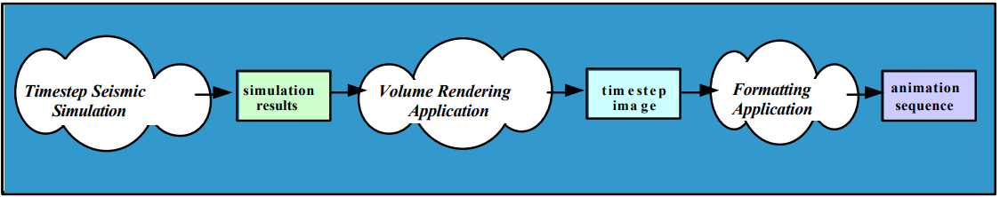

# 03 Prepare: Processes and Analyzing Programs

## Overview

This week's lesson is on Python processes and Introduction to Analyzing programs for parallelism.

## Python Process

We have been using threads in Python.  Threads in Python are limited where only one thread can run at a time because of the GIL.  Threads are concurrent but not parallel.

Processes do not have this limit.  Each process created in Python contains it's own GIL.  This allows processes to run on different CPUs on the computer and are running concurrently and parallel.

## Differences between threads and processes (From week 01)

### Python Global Interpreter (GIL)

Before we can talk about threads and processes, we need to understand the Python Global Interpreter Lock or GIL. It is a mutex (or a lock) that allows only one thread to hold the control of the Python interpreter.

This means that only one thread can be in a state of execution at any one time. If you write single-threaded programs, then the GIL has no impact.  However, when writing parallel and concurrent programs, it is critical to understand it.

### Process

A "Process" is a program that has been loaded by the operating system and is running.  It contains 1 to N threads.  All processes contain a main thread.  The operating system will start that main thread for the process and when that main thread ends, the process ends. [Process (computing)](https://en.wikipedia.org/wiki/Process_(computing))


### Thread

A thread is the smallest unit managed by the operating system that is scheduled to run on the CPU. All processes contain a main thread.[Thread (computing)](https://en.wikipedia.org/wiki/Thread_(computing))


### How Python handles threads and processes

Because of the GIL, all threads are running concurrently in your program.  The operating system will give each thread a little time slice on the CPU where it will appear that they are all running at the some time.

When you create a process in Python, each process will contain their own instance of a GIL.  This allows each process to run in parallel on the computer.  This is because the operating system is free to place each Python process on a different CPU.

### I/O and CPU Bound code

Computer programs have been analyzed for many years and researchers have noticed that during the life of a process, the process will **switch** between waiting for I/O (ie., user input, Internet requests, file accesses) and running instructions on the CPU (ie., calculations, graphics, etc...).

**I/O Bound**

> In computer science, I/O bound refers to a condition in which the time it takes to complete a computation is determined principally by the period spent waiting for input/output operations to be completed. This is the opposite of a task being CPU bound. This circumstance arises when the rate at which data is requested is slower than the rate it is consumed or, in other words, more time is spent requesting data than processing it.  [I/O Bound Webpage](https://en.wikipedia.org/wiki/I/O_bound)

In Python, threads are used for I/O Bound problems

**CPU Bound**

> In computer science, a computer is CPU-bound (or compute-bound) when the time for it to complete a task is determined principally by the speed of the central processor: processor utilization is high, perhaps at 100% usage for many seconds or minutes. [CPU Bound Webpage](https://en.wikipedia.org/wiki/CPU-bound)

In Python, processes are used for CPU Bound problems

## multiprocessing module

[multiprocessing Module](https://docs.python.org/3/library/multiprocessing.html)

> multiprocessing is a package that supports spawning processes using an API similar to the threading module. The multiprocessing package offers both local and remote concurrency, effectively side-stepping the Global Interpreter Lock by using subprocesses instead of threads. Due to this, the multiprocessing module allows the programmer to fully leverage multiple processors on a given machine. It runs on both Unix and Windows.

> The multiprocessing module also introduces APIs which do not have analogs in the threading module. A prime example of this is the Pool object which offers a convenient means of parallelizing the execution of a function across multiple input values, distributing the input data across processes (data parallelism).

To add processes to your Python program, you need to import the `multiprocessing` module.  Note in the code sample below that processes are created and used just like threads.

```python
import multiprocessing as mp

def func(name):
    print(f'hello {name}')

if __name__ == '__main__':
    p = mp.Process(target=func, args=('bob',))
    p.start()
    p.join()
```

Here is a code sample calling a function that changes a global variable.  The function is called from a process then a thread.

```python
import threading
import multiprocessing as mp

global_var = 0

def func(name):
    global global_var
    global_var = 123456
    print(f'{name}: {global_var}')

if __name__ == '__main__':

    print(f'Before process global_var = {global_var}')
    p = mp.Process(target=func, args=('bob',))
    p.start()
    p.join()
    print(f'After process global_var = {global_var}')

    print()

    print(f'Before thread global_var = {global_var}')
    t = threading.Thread(target=func, args=('bob',))
    t.start()
    t.join()
    print(f'After thread global_var = {global_var}')
```
Output:

```
Before process global_var = 0
bob: 123456
After process global_var = 0

Before thread global_var = 0
bob: 123456
After thread global_var = 123456
```

In the output, you see that the thread was able to change the global variable while the process wasn't.  This is because the process, when created, gets it's own GIL and it's own copy of `global_var`.  This is different than the `global_var` in the main thread.  This is why it doesn't change.  Another reason not to use global variables.

## Process Pool and Map() function

[Python Documentation](https://docs.python.org/3/library/multiprocessing.html#module-multiprocessing.pool)

The pool feature of the multiprocessing package allows you to indicate the number of processes that you want to use for a parallel section of your program.

Break down of the following example:

**with mp.Pool(2)**

This creates a process pool of 2 processes.  They are not running at this point.

**p.map(func, names)**

The map function takes in a reference to a function that you want to apply to the process pool.  The function that you place in the first argument can only have 1 argument. 

The second argument is a list of items that you want the processes to use.  The Pool will divide up the list for the processes in the pool to use.  In this case, `'John'` was used by one process where the process called `func('John')`.  Then 'Mary' was used by the other process (or the same one for 'John'), etc. until all of the items in the list are used.

In the output, you can see that process 1 called func() with two names from the list and the other process handled the other three.  (The function func() required a sleep() call because all of the names in the list would have been processed by just one of the processes).


```python
import os
import time
import multiprocessing as mp

def func(name):
    time.sleep(0.5)
    print(f'{name}, {os.getpid()}')

if __name__ == '__main__':

    names = ['John', 'Mary', 'April', 'Murry', 'George']

    # Create a pool of 2 processes
    with mp.Pool(2) as p:
        # map those 2 process to the function func()
        # Python will call the function func() alternating items in the names list.
        # the two processes will run in parallel
        p.map(func, names)
```

output:

```
Mary, 23316
Murry, 23316
John, 3672
April, 3672
George, 3672
```

Here is an example of using tuples for the argument to the function used for a process pool.  Notice the output order from the program.  The first tuple in the list was `(1, 2)`.  However, it wasn't the first tuple processed by the pool.  You can't depend on any order of processing while using a pool - you just know that it will be all processed.

```Python
import os
import time
import multiprocessing as mp

def add_two_numbers(values):
	# The sleep is here to slow down the program
    time.sleep(0.5)
    number1 = values[0]
    number2 = values[1]
    print(f'PID = {os.getpid()}: {number1} + {number2} = {number1 + number2}')

if __name__ == '__main__':

	# create argument list for the pool
    numbers = []
    numbers.append((1, 2))
    numbers.append((11, 52))
    numbers.append((12, 62))
    numbers.append((13, 72))
    numbers.append((1312, 2272))
    numbers.append((1332, 732))
    numbers.append((13434, -23272))

    print(f'Numbers list: {numbers}')

    # Create a pool of 2 processes
    with mp.Pool(2) as p:
        p.map(add_two_numbers, numbers)
```

output:

```
Numbers list: [(1, 2), (11, 52), (12, 62), (13, 72), (1312, 2272), (1332, 732), (13434, -23272)]
PID = 27284: 1 + 2 = 3
PID = 27284: 12 + 62 = 74
PID = 27284: 1332 + 732 = 2064
PID = 6132: 11 + 52 = 63
PID = 6132: 13 + 72 = 85
PID = 6132: 1312 + 2272 = 3584
PID = 6132: 13434 + -23272 = -9838
```

Here is the output of the same program above using a pool size of 4. Notice that the list of numbers was spread over the processes. (ie., load balancing).

```
PID = 26204: 13 + 72 = 85
PID = 4520: 1 + 2 = 3
PID = 4520: 1332 + 732 = 2064
PID = 27168: 11 + 52 = 63
PID = 27168: 1312 + 2272 = 3584
PID = 14268: 12 + 62 = 74
PID = 14268: 13434 + -23272 = -9838
```

Finally, the size of your process pool should not be greater than the number of CPUs on your computer.  Why is that?

# Analyzing Programs

The goal of a software developer is to study and analyses algorithms.  For concurrency and parallelism, we are looking to see if it makes sense to take the time to try to make it concurrent or parallel.  Adding parallelism to software involves a learning curve and requires more effort.

## Fine-grained, coarse-grained, and embarrassing parallel

Applications are often classified according to how often their sub tasks need to synchronize or communicate with each other. An application exhibits fine-grained parallelism if its sub tasks must communicate many times per second; it exhibits coarse-grained parallelism if they do not communicate many times per second, and it exhibits embarrassing parallelism if they rarely or never have to communicate. Embarrassingly parallel applications are considered the easiest to add parallelism.

(Parts of the following is from [Parallelism Document](https://web.engr.oregonstate.edu/~pancake/presentations/sdsc.pdf))

## Embarrassingly parallel

The best type of software to make parallel is called [Embarrassingly parallel](https://en.wikipedia.org/wiki/Embarrassingly_parallel).

> Parallel computing, a paradigm in computing which has multiple tasks running simultaneously, might contain what is known as an embarrassingly parallel workload or problem (also called `perfectly parallel`, `delightfully parallel` or `pleasingly parallel`). An embarrassingly parallel task can be considered a trivial case - little or no manipulation is needed to separate the problem into a number of parallel tasks. This is often the case where there is little or no dependency or need for communication between those parallel tasks, or for results between them.

> Thus, these are different from distributed computing problems that need communication between tasks, especially communication of intermediate results. They are easy to perform on server farms which lack the special infrastructure used in a true supercomputer cluster. They are thus well suited to large, Internet-based distributed platforms such as BOINC, and do not suffer from parallel slowdown. The opposite of embarrassingly parallel problems are inherently serial problems, which cannot be parallelized at all.

> A common example of an embarrassingly parallel problem is 3D video rendering handled by a graphics processing unit, where each frame (forward method) or pixel (ray tracing method) can be handled with no interdependency. Some forms of password cracking are another embarrassingly parallel task that is easily distributed on central processing units, CPU cores, or clusters.

Unfortunately, there are not a great deal of embarrassingly parallel problems to find.  There is, of course, the other extreme case where a program can not have any parallelism. (For example, a shopping cart program.  The program can't do anything until the user makes a choice to do something).

One of the goals of this course is to understand that we might be able to add parallelism to programs and if it makes sense and is possible, then we can speed up the software.

Examples:

- 3D image rendering
- Low level image processing
- Genetic programming — In genetic programming, algorithms are "evolved" in groups by combining and mutating previous generations. Each of these individuals are processed independently in parallel.
- Mandelbrot set — A fractal where each point is calculated individually, independent of the others.
- Monte Carlo algorithms — A wide range of computational tasks that are processed by pseudorandom sampling of individual elements.
- DFT (Discrete Fourier Transform) — A widely-used technique for processing equally-spaced samples of a function or signal. Commonly used in DSP (digital signal processing), based on the work of French mathematician Jean Fourier.
- Brute-force cryptographic tasks — A range of cryptographic problems, such as Proof-of-Work algorithms, that perform many similar computations, efficiently executed in parallel.

## Pipeline Parallelism

Some software problems can be expressed in a pipeline where one stage creates data for the next stage, and so on.  Computer graphic cards (GPUs) use the pipeline method.

- Data from different time steps used to generate series of images
- Job can be subdivided into phases which process the output of earlier phases
- Concurrency comes from overlapping the processing for multiple phases
- Key characteristic: only need to pass results one-way
  - Can delay start-up of later phases so input will be ready
- Potential problems
  - Assumes phases are computationally balanced 





## Fully Synchronous Parallelism

- Same operation is applied in parallel to multiple data.
- Examples include weather predictions
- Key characteristic: Each operation is performed on all (or most) data
  - Operations/decisions depend on results of previous operations
- Potential problems
  - Serial bottlenecks force other processors to “wait”

## Loosely Synchronous Parallelism

- Amount of computation varies dramatically in time and space
- Concurrency from letting different processors proceed at their own rates
- Key characteristic
  - Processors each do small pieces of the problem, sharing information only intermittently
- Potential problems
  - Sharing information requires “synchronization” of processors (where one
processor will have to wait for another)

## Rules-of-Thumb Based on Type of Problem

1. If your application fits the model of perfect parallelism
     - the parallelization task is relatively straightforward and likely to achieve respectable performance
2. If your application is an example of pipeline parallelism
     - you have to do more work. If you can’t balance the computational intensity, it may not prove worthwhile
3. If your application is fully synchronous
     - a significant amount of effort is required and payoff may be minimal. The decision to parallelize should be based on how uniform computational intensity is likely to be
4. A loosely synchronous application is the most difficult to parallelize
     - it’s probably not worthwhile unless the points of CPU interaction are very infrequent
