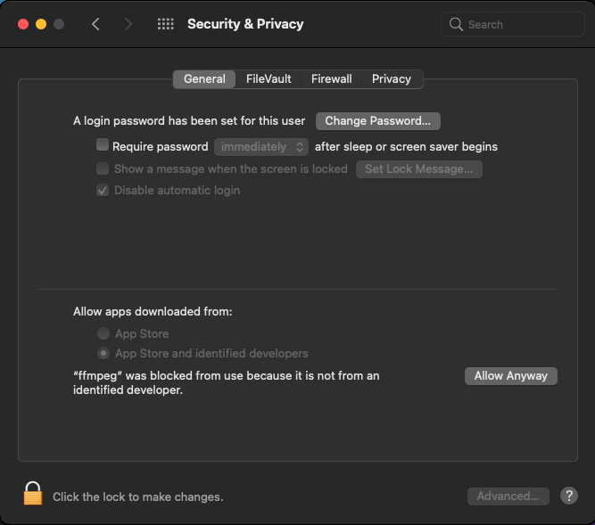
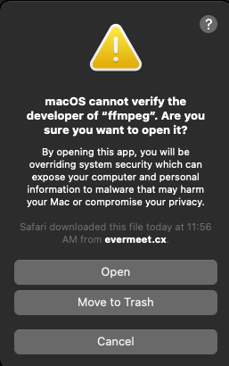
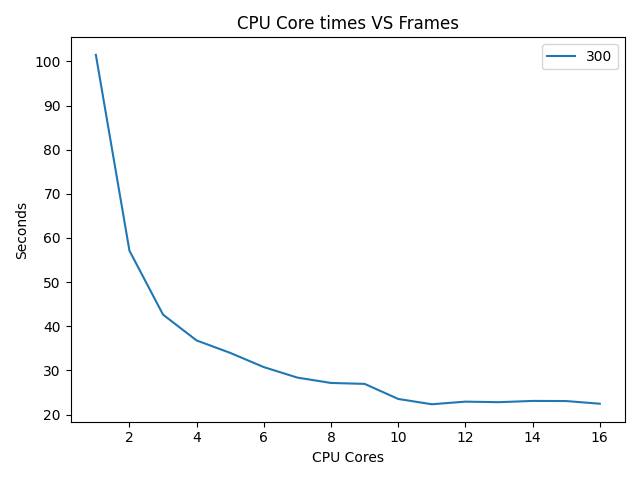

# 03 Prove: Video Frame Processing

## Overview

Processing videos can take a great deal of processing time and resources.  You will be combining two videos together where one video will contain a "green screen".  The results of your assignment will be a new combined video.  The goal of the assignment is to use all of the CPU cores on your computer for the video processing.

## Project Description

### Software Required for the Assignment

**Pillow**

The Python package `pillow` needs to be installed for this assignment.  Follow the same steps when you installed `numpy` and `matplotlib`.

**FFmpeg**

FFmpeg is a free open-course video and image converter.  It is included in the github files for the assignment.  Read below to install it on Windows or Mac.

#### Windows Installation

1. Download `ffmpeg.exe` from the assignment folder in github.
2. Place that exe in the same folder as your other assignment files.

#### MAC Installation

1. Download `mac-ffmpeg-4.3.1.7z` from the assignment folder in github.
2. Place that it in the same folder as your other assignment files.
3. Double click on the `7z` file to un-compress it.  It will create a `ffmpeg` app.  Make sure that this app is in the same folder as your assignment code.

When you have everything in place and try running the `setup_files_dirs.py` program, MAC OS might the following warning message:


Click on `cancel` and go to the `Security & Privacy` options in the settings app.



Click on the "Allow Anyway" button.  Then close this window and return to the Python program.  When you run it, might still get this warning message.  Click on `open` to continue.



### Assignment Files

**`setup_files_dirs.py`**

After you download the assignment files from GitHub, run this program to create the sub-folders required for the assignment.  It will also decode the two mp4 files and create individual frame images and place them in the created sub-folders.

You must have the program `ffmpeg` in the same folder as this program.

**`assignment.py`**

This is the assignment file that you will write your program. Look for the `TODO` in comments.  The code in the main function will create a plot of the number of frames that you process and their times.

**`elephants.mp4`**

Short video of elephants.

**`green.mp4`**

Short video of a TV with the screen all green.

**`create_final_video.py`**

Once you have created all of the frames in the `processed` folder, run this program.  It will create a video based on the images found in `processed`.  The video that is created will be called `final.mp4`.  You are not submitting this final video file, only your Python code.

Note, I had problems viewing the final video using the default video player in Windows.  I downloaded **VLC Player** and was able to view the video.

### Directory Structure

After you run `setup_files_dirs.py`, you will have the following directory structure.  (There is sample code in `assignment.py` that uses these folders)

```text
assignment
  |- elephant (Contains elephant frames)
  |- green (Contains green screen frames)
  |- processed (Contains you processed frame images that you create)
```

## Assignment

1. Take a look at the code in `assignment.py` and the `TODO` in the comments.  Your goal is to process all 300 frames from the `elephant` and `green` folders to create 300 new frames in the `processed` folder.

1. You must use the map() function in mp.pool() for this assignment. (ie., p.map(function, data))

1. Your program will process all of the frames using 1 CPU core.  You will need to keep track of the time it took to process all of the frames.  (See the main code for the variables that will be used.)

1. Then, you will process all of the frames using 2 CPU cores and record to the time it took.  Then 3 CPU cores, 4 CPU cores, etc... until you reach `CPU_COUNT` CPU cores.

On my computer, I have 12 CPU cores.  The const variable `CPU_COUNT` is set to 4 more the number of CPU cores on your computer.  So for me CPU_COUNT equals 16.  Here is a example of the plot that is created for 16 CPU cores.  Notice that the processing time decreases with more CPU cores.  Your results might/should be different on your computer.



Here is a example log file for 16 CPUs

```
10:50:35| Time for 300 frames using 1 processes: 101.8020556
10:51:46| Time for 300 frames using 2 processes: 71.93878520000001
10:52:45| Time for 300 frames using 3 processes: 58.97159289999999
10:53:31| Time for 300 frames using 4 processes: 45.3859032
10:54:07| Time for 300 frames using 5 processes: 36.22025639999998
10:54:41| Time for 300 frames using 6 processes: 34.265467599999965
10:55:11| Time for 300 frames using 7 processes: 29.98336469999998
10:55:42| Time for 300 frames using 8 processes: 31.0306688
10:56:14| Time for 300 frames using 9 processes: 32.005908199999965
10:56:44| Time for 300 frames using 10 processes: 30.009154299999977
10:57:14| Time for 300 frames using 11 processes: 29.614024700000016
10:57:44| Time for 300 frames using 12 processes: 29.636116699999945
10:58:12| Time for 300 frames using 13 processes: 28.241375600000083
10:58:41| Time for 300 frames using 14 processes: 28.767867000000024
10:59:07| Time for 300 frames using 15 processes: 26.312874100000045
10:59:34| Time for 300 frames using 16 processes: 27.02049850000003
10:59:34| Total Time for ALL procesing: 641.3756915
```

You will be creating a plot graph image and a log file.  Both of these will be submitted with your Python program in I-Learn.

## Rubric

Assignments are not accepted late. Instead, you should submit what you have completed by the due date for partial credit.

Do not use different videos than the ones included in this assignment.

Assignments are individual and not team based.  Any assignments found to be  plagiarised will be graded according to the `ACADEMIC HONESTY` section in the syllabus. The Assignment will be graded in broad categories as outlined in the syllabus:

## Submission

When finished, you will be uploading the following in I-Learn.  Do **NOT** zip your files.

1. Your Python program.
2. Plot graph generated by your program.
3. Log file created by your program for generating the plot graph image.

