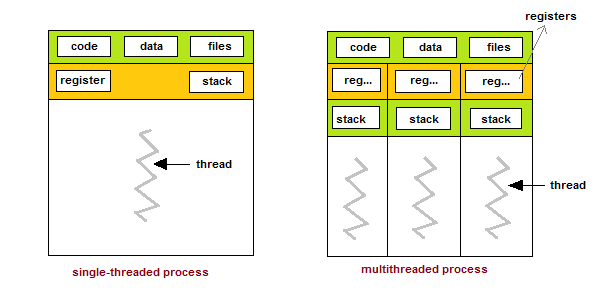
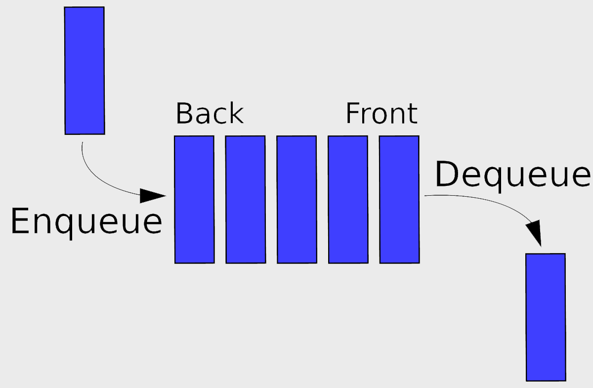

# 04 Prepare: Queues, Locks and Semaphores

## Overview

This week's lesson is on thread synchronization and sharing of data between threads


> **Hint from Instructor**
> 
> Please take the time to copy these code samples in the reading material to try them on your computer.


## Review of what is shared between threads

The definition of a process is a program that has been loaded into memory.  All processes contain a main thread.  Once the main thread finishes, the process is also finished.  

On the left side of the figure below, this process has the main thread running.  This thread has full access to data, files, registers and stack - the whole program.

The right hand side of the figure shows three threads running in a process.  One of the threads is the main thread.  Note that they all share the common data and files of the process.  However, each thread has their own registers and stack.  This means that when a thread creates a local variable, that variable is not shared with another other threads.

Global variables are shared with each thread.  Although, we don't like to use global variables, they are sometimes used in multi-threaded and multi-processor programs.  They will be used sparingly in the course.



-- https://www.studytonight.com/operating-system/multithreading

The `threading` module in Python contains data structures to help with the sharing of data and synchronization.

## Queue

One data structure that is used to share data between threads is called a queue.  It is a FIFO structure (First-In First-Out).  Items are added to the queue at one end. (This is the Python `put()` function).  Then items are removed from the other end. (Python uses the `get()` function)



- [Python Documentation](https://docs.python.org/3/library/queue.html)
- [Python documentation on threading queue](https://docs.python.org/3/library/queue.html)
- [Python Queue Video](https://www.youtube.com/watch?v=TQx3IfCVvQ0)

The Queue data structure is `thread safe` which means that the `get()` and `put()` when used will add or remove an item from the queue without race conditions.  These methods or operations are called atomic.

Here is an example of creating and using a queue.  Note that `queue` is not part of the threading module.

```python
import queue

q = queue.Queue()

q.put('House')
q.put('tree')
q.put('Farm')
q.put('Truck')

print(f'Size of queue = {q.qsize()}')
print(f'Get an item from the queue: {q.get()}')

print(f'Size of queue = {q.qsize()}')
print(f'Get an item from the queue: {q.get()}')
```

Output:

```
Size of queue = 4
Get an item from the queue: House
Size of queue = 3
Get an item from the queue: tree
```

**get() method**

If a thread uses `get()` on a queue where there are no items in it, that thread will be suspended (placed on the Blocked queue in the operating system) until there is something in the queue.  If an item is never added to the queue, this is a deadlock situation where the program hangs.

Example of using a queue in a thread:


```python
import threading, queue

def thread_function(q):
    item = q.get()
    print(f'Thread: {item}')

def main():
	q = queue.Queue()

	q.put('one')
	q.put('two')
	q.put('three')

	# Create 3 threads - This is a list comprehension
	# Pass the queue as an argument to the threads
	threads = [threading.Thread(target=thread_function, args=(q, )) for _ in range(3)]

	# start all threads
	for i in range(3):
		threads[i].start()

	# Wait for them to finish
	for i in range(3):
		threads[i].join()

	print('All work completed')

if __name__ == '__main__':
	main()
```

Output:

```
Thread: one
Thread: two
Thread: three
All work completed
```

### Queue deadlock situation

[Issue with not clearing a Queue](https://docs.python.org/3/library/multiprocessing.html#synchronization-between-processes)

> The following is from the above link

Bear in mind that a process/thread that puts items in a queue will wait before terminating until all the buffered items are fed by the “feeder” thread to the underlying pipe. (The child process can call the `Queue.cancel_join_thread` method of the queue to avoid this behavior.)

This means that whenever you use a queue you need to make sure that all items which have been put on the queue will eventually be removed before the process is joined. Otherwise you cannot be sure that processes/threads which have put items on the queue will terminate. Remember also that non-daemonic processes will be joined automatically.

An example which will deadlock is the following:

```python
from multiprocessing import Process, Queue

def f(q):
    q.put('X' * 1000000)

if __name__ == '__main__':
    queue = Queue()
    p = Process(target=f, args=(queue,))
    p.start()
    p.join()                    # this deadlocks
    obj = queue.get()

```

A fix here would be to swap the last two lines.


## Review of Locks

Locks are used to protect a critical section in your program.  Critical sections can be accessing variables, data structures, file access, database access, etc.  If locks are used too often, then the program becomes linear in execution.  The best situation in designed threaded programs is to not use locks at all.  In the video processing assignment, each process was able to work without any synchronization between them.

[Threading locks Documentation](https://docs.python.org/3/library/threading.html#lock-objects)


### Example 1

Here is a small program that will create three threads where each one will update the first item in a list.  Then it will display the results.  In the code below, it displays the correct value of 30,000.  There are no locks used.

```python
import threading, time

THREADS = 3
ITEMS = 10000

def thread_function(data):
    for i in range(ITEMS):
        data[0] += 1

def main():    
    data = [0]
    start_time = time.perf_counter()

    # Create threads
    threads = [threading.Thread(target=thread_function, args=(data, )) for _ in range(THREADS)]

    for t in threads:
        t.start()

    for t in threads:
        t.join()

    print(f'All work completed: {data[0]:,} in {time.perf_counter() - start_time:.5f} seconds')

if __name__ == '__main__':
    main()
```

Output:

```
All work completed: 30,000 in 0.00295 seconds
```

### Example 2

Same program as above but looping 1,000,000 times.  The results should be 3,000,000, but it isn't.  In fact, each time the the program is run, different results are displayed.  This is caused by a race condition for the first element in the list.

```python
import threading, time

THREADS = 3
ITEMS = 1000000

def thread_function(data):
    for i in range(ITEMS):
        data[0] += 1

def main():    
    data = [0]
    start_time = time.perf_counter()

    # Create threads
    threads = [threading.Thread(target=thread_function, args=(data, )) for _ in range(THREADS)]

    for t in threads:
        t.start()

    for t in threads:
        t.join()

    print(f'All work completed: {data[0]:,} in {time.perf_counter() - start_time:.5f} seconds')

if __name__ == '__main__':
    main()
```

Output:

```
All work completed: 1,717,014 in 0.19610 seconds
```

### Example 3

We can fix the race condition by adding a lock around `data[0] += 1`.  We got the right answer with adding a lock, but the execution time of the program is now 5 seconds.

```python
import threading, time

THREADS = 3
ITEMS = 1000000

def thread_function(lock, data):
    for i in range(ITEMS):
        with lock:
            data[0] += 1

def main():    
    lock = threading.Lock()
    data = [0]
    start_time = time.perf_counter()

    # Create threads
    threads = [threading.Thread(target=thread_function, args=(lock, data)) for _ in range(THREADS)]

    for t in threads:
        t.start()

    for t in threads:
        t.join()

    print(f'All work completed: {data[0]:,} in {time.perf_counter() - start_time:.5f} seconds')

if __name__ == '__main__':
    main()    
```

Output:

```
All work completed: 3,000,000 in 5.09544 seconds
```


### Example 4

The best fix to this race condition example, is to remove the race condition.  In the three threads, they are all updating the same variable.  The fix is to have each thread have it's own variable to update.  These variables will be totaled after the threads are finished.

```python
import threading, time

THREADS = 3
ITEMS = 1000000

def thread_function(data, index):
    for i in range(ITEMS):
        data[index] += 1

def main():    
    data = [0] * THREADS   # Each thread uses it's own index into the list
    start_time = time.perf_counter()

    # Create threads
    threads = [threading.Thread(target=thread_function, args=(data, index)) for index in range(THREADS)]

    for t in threads:
        t.start()

    for t in threads:
        t.join()

    print(f'All work completed: {sum(data):,} in {time.perf_counter() - start_time:.5f} seconds')

if __name__ == '__main__':
    main()     
```

Output:

```
All work completed: 3,000,000 in 0.21455 seconds
```

### Example 5

Here is an example of using a shared queue between two threads.  Note that the number of `put()` calls must match the number of `get()` calls.  If this is not the case, you might/will have deadlock.

```python
import threading
import queue

MAX_COUNT = 10

def read_thread(shared_q):
    for i in range(MAX_COUNT):
        # read from queue
        print(shared_q.get())

def write_thread(shared_q):
    for i in range(MAX_COUNT):
        # place value onto queue
        shared_q.put(i)

def main():
    """ Main function """

    shared_q = queue.Queue()

    write = threading.Thread(target=write_thread, args=(shared_q,))
    read = threading.Thread(target=read_thread, args=(shared_q,))

    read.start()        # doesn't matter which starts first
    write.start()

    write.join()		# Doesn't matter the order
    read.join()

if __name__ == '__main__':
    main()
```

Output:

```
0
1
2
3
4
5
6
7
8
9
```

## Semaphores

- [Thread Semaphore Document](https://docs.python.org/3/library/threading.html#semaphore-objects)
- [Wikipedia page](https://en.wikipedia.org/wiki/Semaphore_(programming))
- [Read the first two sections on locks and semaphores](https://hackernoon.com/synchronization-primitives-in-python-564f89fee732)

> In computer science, a semaphore is a variable or abstract data type used to control access to a common resource by multiple processes and avoid critical section problems in a concurrent system such as a multitasking operating system. A trivial semaphore is a plain variable that is changed (for example, incremented or decremented, or toggled) depending on programmer-defined conditions.

> **A useful way to think of a semaphore as used in a real-world system is as a record of how many units of a particular resource are available, coupled with operations to adjust that record safely (i.e., to avoid race conditions) as units are acquired or become free, and, if necessary, wait until a unit of the resource becomes available.**

> Semaphores are a useful tool in the prevention of race conditions; however, their use is by no means a guarantee that a program is free from these problems. Semaphores which allow an arbitrary resource count are called counting semaphores, while semaphores which are restricted to the values 0 and 1 (or locked/unlocked, unavailable/available) are called binary semaphores and are used to implement locks.

> The semaphore concept was invented by Dutch computer scientist Edsger Dijkstra in 1962 or 1963, when Dijkstra and his team were developing an operating system for the Electrologica X8. That system eventually became known as THE multiprogramming system.

Whereas a `Lock` is a "only allow one thread in at a time".  A `Semaphore` allows multiple threads to enter an area of code.

When a semaphore is created, you can indicate that number of concurrent threads that can be allowed "in".  They are used to control access to data not threads.  They are a synchronization construct whereas a lock is mutual exclusion control.

```python
sem = Semaphore(count)

sem.acquire()
# Do something
sem.release()
```

Each time `acquire()` is called, two outcomes are possible.  

1. If the semaphore count is zero, then that thread will be suspended.
2. If the count is >0, then the count is decreased by one and the thread gains access to the protected code.  
 
When a thread calls `release()` on the semaphore, the count is increased by one and the operating system will "wake up" any threads waiting on the semaphore.

Having a thread wait on a semaphore that is never `released()` is a deadlock situation. Semaphores are often used with locks.  A semaphore of size 1 is the same as a lock.