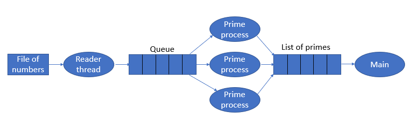

# 05 Teach: Using Semaphores, Queue and List

## Overview

Your team will be creating thread and processes to check a list of prime numbers from a file.

## Assignment

The following graph outlines the processes and data structures that you will need to solve this program.

**data.txt** This is the file that contains a list of numbers to test if they are prime.  This file is created by the team activity program.

**Reader Thread** This is a thread that will read the data file and place items onto a Queue.  There is no limit on the size of the queue.

**Queue** This is a multiprocessing Queue.

**Prime Process** This is a process that will read something from the Queue and check to see if it is a prime number.  If the number is prime, it will place the number on a shared list.  You need 3 of these processes.

**List of Primes** This is a shared List that will contain the prime numbers

**Main** This is the main code that will create the thread, processes, queue, semaphore(s), and list.  It will display all of the prime numbers after the `prime process`'s are finished.

### Requirements

1. Download the file `team.py` from GitHub [File Link](team/team.py)
2. Read the numbers from the data file into a queue.
3. Create three `prime processes`'s that will test the numbers from the queue
4. Do not hard code the number of values that the program will process. Your program needs to handle any number of values in a data file.
5. Get main to display the final list of prime numbers.
6. After you get the program working, change it to handle any number of `prime process` processes.

## Sample Solution

We will go over the solution in the next class lesson.

## Submission

When complete, please report your progress in the associated I-Learn quiz.

