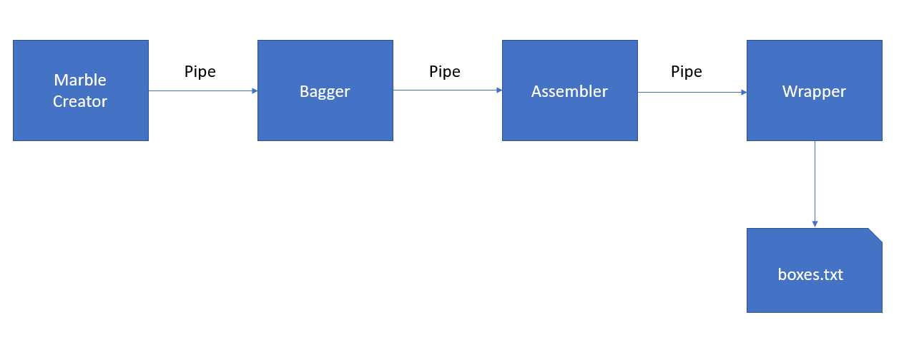

# 06 Prove: Processing Plant

## Overview

## Project Description

A gift processing plant needs to create gifts for Christmas.  A gift consists of a large marble with other smaller marbles.

### Factory Layout




**Marble Creator**

This step in the gift creation process, creates the small marbles for the gift.  Marbles are sent one at a time to the Bagger.

**Bagger**

The bagger takes the marbles received from the marble creator and when there are enough marbles collected for a gift, it sends the marbles to the assembler as a Bag object.

**Assembler**

The assembler will take the received bag and create a gift.  The gift will contain a large marble and the bag of smaller marbles.  The gift is then sent to the wrapper.

**Wrapper**

The wrapper takes the gift and saves it to the boxes file.

### Settings file

There is a file `settings.txt` that contains a number of values that will be used in your program.  Here is an example of a settings file.  Note, that I might run your submitted program with a different settings file.

The `*-delay` values are used to delay the different steps/processes in the factory.  For example, the value of `bagger-delay` is used after the bagger sends a bag to the assembler. (ie., the sleep() function).  There are four processes each with their own sleep delay.

`bag-count` is used to indicate how many small marbles to place in a bag.

`marble-count` is the number of marbles that the marble creator will create.

```
{
    "marble-count":1000,
    "creator-delay":0.01,
    "bagger-delay":0.05,
    "assembler-delay":0.05,
    "wrapper-delay":0.05,
    "bag-count":7
}
```


## Assignment

1. Download the `assignment.py` and `settings.txt` files to your computer in one directory.
2. `assignment.py` includes `TODO` comments that you need to implement.

Your program will create a file called `boxes.txt` that will contain the created gifts.  Here are a few lines from this file.  (You can get the current time using `datetime.now().time()`)

```
Created - 11:51:13.400554: Large marble: Winner, marbles: Royal Red, Orange Soda, Antique Brass, Arylide Yellow, Bistre Brown, Neon Silver, Pale Taupe
Created - 11:51:13.499239: Large marble: Zeus, marbles: Cotton Candy, Middle Red Purple, Shandy, Middle Red Purple, Lavender Purple, Gold, Big Dip O’ruby
Created - 11:51:13.613511: Large marble: Winner, marbles: Gold, Lilac Luster, Pale Taupe, Dark Moss Green, Safety Yellow, Terra Cotta, Royal Red
Created - 11:51:13.715206: Large marble: Winner, marbles: Antique Bronze, Almond, Granny Smith Apple, Royal Red, Maximum Blue, Orange Soda, Ivory
Created - 11:51:13.830252: Large marble: Apollo, marbles: Outrageous Orange, Duke Blue, Royal Blue, Neon Pink, Pale Plum, Pastel Blue, Lavender Blue
Created - 11:51:13.934839: Large marble: Winner, marbles: Spanish Carmine, Gold, Lumber, Maximum Purple, Beaver, Mode Beige, Isabelline
Created - 11:51:14.047409: Large marble: Hercules, marbles: Eerie Black, Royal Blue, Russian Violet, Blue Bell, Neon Silver, Golden Yellow, Royal Blue
Created - 11:51:14.163620: Large marble: The Boss, marbles: Spanish Orange, Pale Goldenrod, Silver Pink, Arylide Yellow, Blue, Purple, Brown
Created - 11:51:14.266084: Large marble: Apollo, marbles: Antique Brass, Safety Yellow, Gold, Eerie Black, Spanish Carmine, Blue-Green, Middle Red Purple
Created - 11:51:14.382115: Large marble: The Boss, marbles: Maximum Purple, Ruby, Orange Soda, Pale Cerulean, Big Dip O’ruby, Outrageous Orange, Isabelline
Created - 11:51:14.484143: Large marble: The Boss, marbles: Middle Green, Vegas Gold, Granny Smith Apple, Russian Violet, Almond, Liver Chestnut, Big Dip O’ruby
Created - 11:51:14.600989: Large marble: Apollo, marbles: Ivory, Emerald, Silver Pink, Blue, Brink Pink, La Salle Green, Silver Pink
Created - 11:51:14.703342: Large marble: Apollo, marbles: Terra Cotta, Mode Beige, Orange Soda, Venetian Red, Blue Bell, Slate Blue, Blue-Green
Created - 11:51:14.815352: Large marble: The Boss, marbles: Purple, Ivory, Neon Dark Green, Green, Orange Soda, Neon Pink, Russian Green
Created - 11:51:14.919218: Large marble: Winner, marbles: Ruby, Rose Dust, Terra Cotta, Neon Silver, Neon Dark Green, Brink Pink, Spanish Pink
Created - 11:51:15.030378: Large marble: Sure Shot, marbles: Tuscan Brown, Neon Pink, Rose Dust, Ruby, Bistre Brown, Orange Peel, Spanish Pink

```
        
## Rubric

Assignments are not accepted late. Instead, you should submit what you have completed by the due date for partial credit.

Assignments are individual and not team based.  Any assignments found to be  plagiarised will be graded according to the `ACADEMIC HONESTY` section in the syllabus. The Assignment will be graded in broad categories as outlined in the syllabus:
## Submission
To submit your assignment, you need to do two things:

1. Upload your program (the .py file) to I-Learn for feedback.
1. Upload your `boxes.txt` to I-Learn for feedback.
1. Add a submission comment that specifies the grading category that best describes your assignment along with a 1-2 sentence justification for your choice. The grading criteria are:
