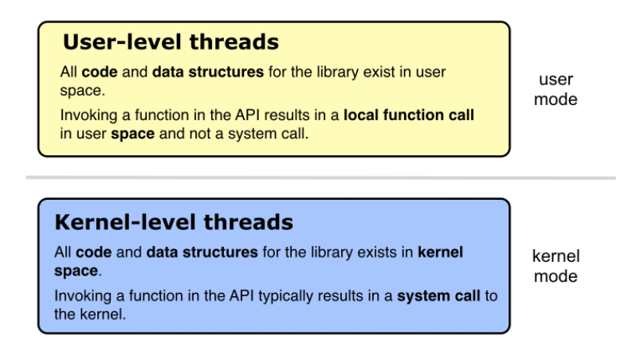
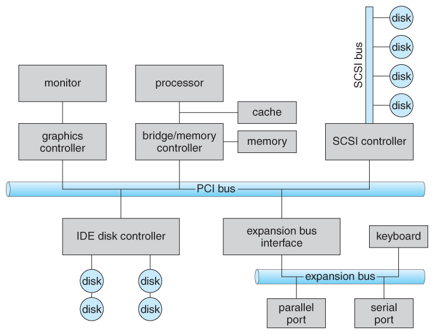
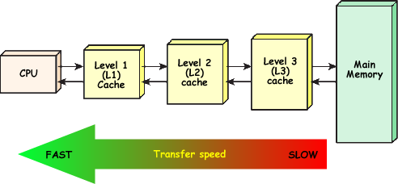
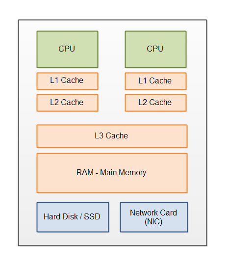
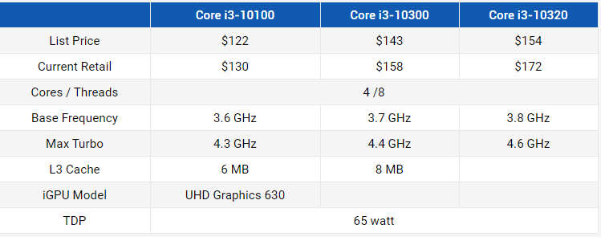
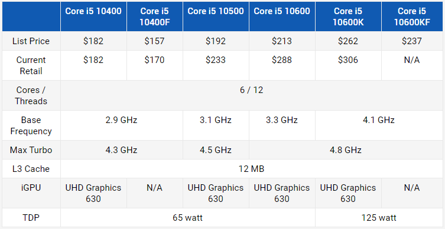
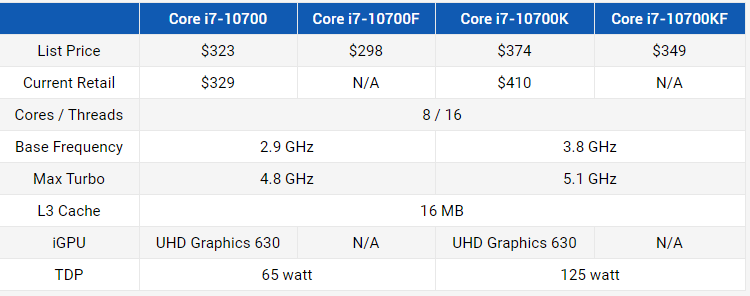
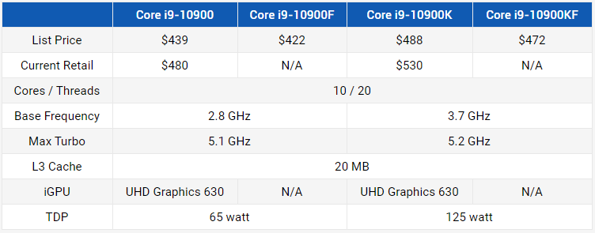

# 08 Prepare: User/Kernel Threads and Computer Architecture

## User and Kernel Threads

[Wikipedia Threads](https://en.wikipedia.org/wiki/Thread_\(computing\))

(The following section was taken from https://www.tutorialspoint.com/operating_system/os_multi_threading.htm)

A thread is a thread is a thread. However, there are two types of threads.  User and Kernel threads.

A User thread is one that executes user-space code.  It is managed by you the programmer or in the case of Python, by the GIL.

A Kernel thread is one that only runs kernel code and isn't associated with a user-space process.  These threads are controlled by the operating system.  You can not create or delete kernel threads.  Each OS has a "kernel" or core.  Kernel threads do not match the number of CPUs on a computer.  The number of these threads can be high.

Threads in processes/programs.  All threads must run in a process.  The definition of a process is a program that is loaded into memory and is running on an operating system.

In an operating system, there are two spaces.  User and kernel space.  A programmer programs in the user space.  In order for your program to do something interesting such as print() to a screen or open a file, etc., it must make a system call (function call) into the kernel space.  A thread library is used to help with these system calls.  For Python, it is the GIL.

### Relation between user and kernel threads

When you start a program on a computer, the OS will load that program into memory (called a process now), and assign some kernel threads to that process.  Kernel threads are the threads that run on CPUs.  There are a number of different user/kernel relationships that can be followed by the OS

#### Many to Many

The many-to-many model multiplexes any number of user threads onto an equal or smaller number of kernel threads.

The following diagram shows the many-to-many threading model where 6 user level threads are multiplexing with 6 kernel level threads. In this model, developers can create as many user threads as necessary and the corresponding Kernel threads can run in parallel on a multiprocessor machine. This model provides the best accuracy on concurrency and when a thread performs a blocking system call, the kernel can schedule another thread for execution

#### Many to One

Many-to-one model maps many user level threads to one Kernel-level thread. Thread management is done in user space by the thread library. When thread makes a blocking system call, the entire process will be blocked. Only one thread can access the Kernel at a time, so multiple threads are unable to run in parallel on multiprocessors.

If the user-level thread libraries are implemented in the operating system in such a way that the system does not support them, then the Kernel threads use the many-to-one relationship modes.

#### One to One

There is one-to-one relationship of user-level thread to the kernel-level thread. This model provides more concurrency than the many-to-one model. It also allows another thread to run when a thread makes a blocking system call. It supports multiple threads to execute in parallel on microprocessors.

Disadvantage of this model is that creating user thread requires the corresponding Kernel thread. OS/2, windows NT and windows 2000 use one to one relationship model.

## Computer Architecture

### Overview

Here is a quick overview of parts of a computer.  The bus is a high-speed internal connection. Buses are used to send control signals and data between the processor and other components.

### CPU Cache

[Video: What is CPU Cache?](https://www.youtube.com/watch?v=sHqNMHf2UNI)

> A CPU cache is a hardware cache used by the central processing unit (CPU) of a computer to reduce the average cost (time or energy) to access data from the main memory.[1] A cache is a smaller, faster memory, located closer to a processor core, which stores copies of the data from frequently used main memory locations. Most CPUs have a hierarchy of multiple cache levels (L1, L2, often L3, and rarely even L4), with separate instruction-specific and data-specific caches at level 1.

Cache levels.  In CPUs today, all three levels are found on the CPU.

The cache memory connects to the motherboard bus.

In this image, you can see that each core of a CPU has their own L1 and L2 cache.  The larger L3 cache is shared between cores.

#### Intel CPUs

Here are comparisons between the Intel i3, i5, i7 and i9 CPUs.  Notice the differences in cache sizes

## Recursion

We will be using recursion for the next assignment.

> In computer science, recursion is a method of solving a problem where the solution depends on solutions to smaller instances of the same problem. Such problems can generally be solved by iteration, but this needs to identify and index the smaller instances at programming time. Recursion solves such recursive problems by using functions that call themselves from within their own code. The approach can be applied to many types of problems, and recursion is one of the central ideas of computer science.

### Links

Review these links if you need to understand recursion more or need to refresh your memory.

- [Recursion (computer science)](https://en.wikipedia.org/wiki/Recursion_\(computer_science\))
- [Recursion in Python](https://realpython.com/python-thinking-recursively/#recursive-functions-in-python)
- [Understanding Recursion](https://stackabuse.com/understanding-recursive-functions-with-python/)
- [Video on Recursion](https://www.youtube.com/watch?v=ngCos392W4w)
- [What on Earth is Recursion? - Computerphile](https://www.youtube.com/watch?v=Mv9NEXX1VHc)