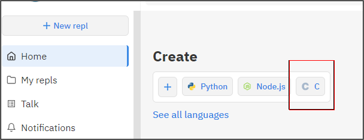
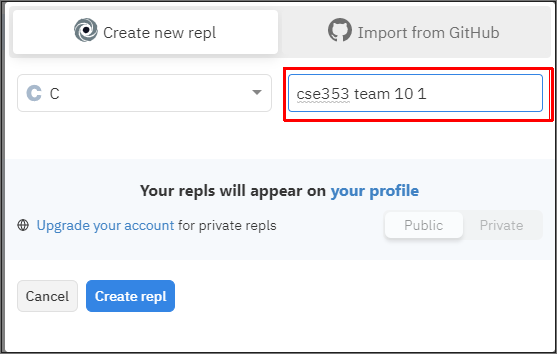
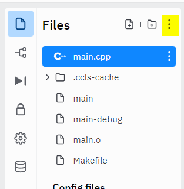
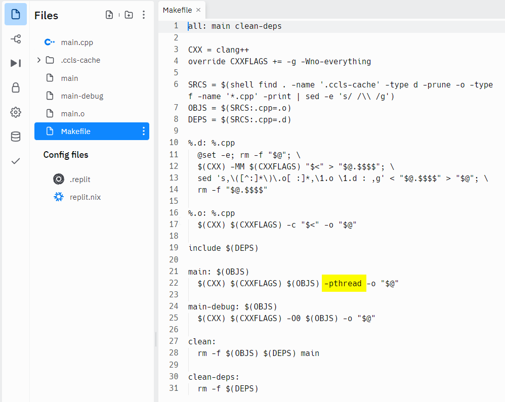

# 10 Teach: PThreads

## Overview

You will be creating a C++ program to search for prime numbers in an array

## Assignment

The file `team1.cpp` contains instructions on this team activity.

## Compiling C++ Programs

### Using online replit.com

Note: This is an option for compiling C++ programs if you don't have a compiler on your computer.

1) Create a free account at [replit.com](www.replit.com)

2) Select C++ option for a project.



3) Give you project a name



4) You need to "turn on" the option to compile programs using PThreads.  Click on the small menu button and select `show hidden files`.



5) Next, select the `Makefile` file and add the following `-pthread` where hightlighted in the image below.



4) Copy `team1.cpp` content to `main.cpp` in repl.it


### Compiling programs in replit.com (if the RUN button doesn't work)

1) In the terminal window, type the following (It is dash small L, not dash one):

```
   > g++ <filename of your program>.cpp -lpthread
```

2) To run your program, type:

```
   > ./a.out
```


### Issues with using Visual Studio

1. Create a console empty project
2. create team1.cpp and copy the content from team1.cpp from Github
3. You will need to install pthreads
   1. project -> Manage Nuget Packages
   1. In browse Tab search for 'pthread'
   2. Select the first library
4. When you try to compile your project, you will get an error in threads.h about a struct become redefined.  Just comment that struct out.


## Sample Solution

No solution provided.

## Submission

When complete, please report your progress in the associated I-Learn quiz.

If you decided to do additional work on the program after your team activity, either by yourself or with others, feel free to include that additional work when you report on your progress in I-Learn.

