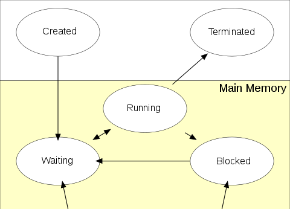
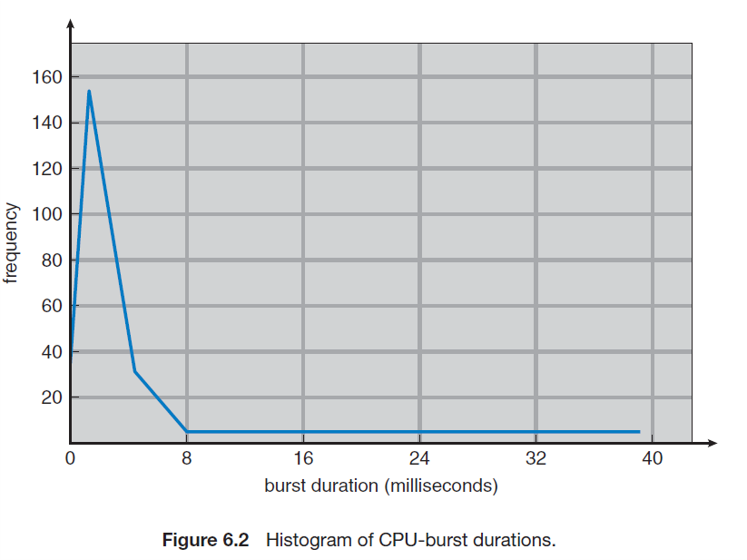
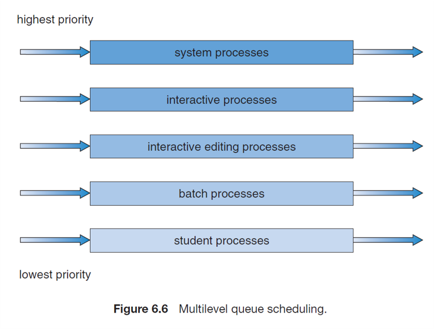

# 13 Prepare: Process Scheduling

## processes

A process be definition is a program that is loaded into memory and is running.  

## process states

A process goes to a small number of states in an operating system.

**Created**

In this stage, the program is loaded into memory and a PCB record is created.

**Waiting**

At first, the process is placed on a waiting queue instead of directly on the CPU.

**Running**

Here the process is running on the CPU.  It can be taken out of running by

1. finishing.  This moved it to the terminated state.
2. Makes an I/O call.  This moves it to the blocked state.
3. It's time on the CPU is over and needs to waiting it's turn.  This moves it to the waiting state.

**Blocked**

The process is waiting for an I/O request.  When the OS finishes the I/O request, the process is places on the waiting queue.

**Terminated**

Here the process is finished.  The OS will clean up any files and memory used by the process.

### Time Slices

> The period of time for which a process is allowed to run in a preemptive multitasking system is generally called the time slice or quantum. The scheduler is run once every time slice to choose the next process to run. The length of each time slice can be critical to balancing system performance vs process responsiveness - if the time slice is too short then the scheduler will consume too much processing time, but if the time slice is too long, processes will take longer to respond to input.
> 
> An interrupt is scheduled to allow the operating system kernel to switch between processes when their time slices expire, effectively allowing the processor's time to be shared between a number of tasks, giving the illusion that it is dealing with these tasks in parallel (simultaneously). The operating system which controls such a design is called a multi-tasking system.

-- [Time Slice](https://en.wikipedia.org/wiki/Preemption_(computing)#:~:text=The%20period%20of%20time%20for,the%20next%20process%20to%20run.&text=The%20operating%20system%20which%20controls,called%20a%20multi%2Dtasking%20system.)

### Interrupts

> In digital computers, an interrupt is a response by the processor to an event that needs attention from the software. An interrupt condition alerts the processor and serves as a request for the processor to interrupt the currently executing code when permitted, so that the event can be processed in a timely manner. If the request is accepted, the processor responds by suspending its current activities, saving its state, and executing a function called an interrupt handler (or an interrupt service routine, ISR) to deal with the event. This interruption is temporary, and, unless the interrupt indicates a fatal error, the processor resumes normal activities after the interrupt handler finishes.
> 
> Interrupts are commonly used by hardware devices to indicate electronic or physical state changes that require attention. Interrupts are also commonly used to implement computer multitasking, especially in real-time computing. Systems that use interrupts in these ways are said to be interrupt-driven.

-- [Interrupt](https://en.wikipedia.org/wiki/Interrupt)

## Context switching

> In computing, a context switch is the process of storing the state of a process or thread, so that it can be restored and resume execution at a later point. This allows multiple processes to share a single central processing unit (CPU), and is an essential feature of a multitasking operating system.
> 
> The precise meaning of the phrase “context switch” varies. In a multitasking context, it refers to the process of storing the system state for one task, so that task can be paused and another task resumed. A context switch can also occur as the result of an interrupt, such as when a task needs to access disk storage, freeing up CPU time for other tasks. Some operating systems also require a context switch to move between user mode and kernel mode tasks. The process of context switching can have a negative impact on system performance.

-- [Context switch](https://en.wikipedia.org/wiki/Context_switch)

## PCB

A process control block (PCB) is a data structure used by computer operating systems to store all the information about a process. It is also known as a process descriptor.

- When a process is created (initialized or installed), the operating system creates a corresponding process control block.
- Information in a process control block is updated during the transition of process states.
- When the process terminates, its PCB is returned to the pool from which new PCBs are drawn.
- Each process has a single PCB.
- A list of files that a process has open is stored.
- A list of memory blocks allocated to the process is stored.

When a process is removed from a CPU in a content switch, it's state on the CPU (ie., registers, program counter, etc.) are saved in their PCB data structure.  When a process terminates, the OS can free any memory allocated to the process as well as close any still opened files.

-- [Process control block](https://en.wikipedia.org/wiki/Process_control_block)

## Scheduling Algorithms

The main purposes of scheduling algorithms are to minimize resource starvation and to ensure fairness amongst the parties utilizing the resources. Scheduling deals with the problem of deciding which of the outstanding requests is to be allocated resources. There are many different scheduling algorithms.

### Goal of scheduling

> The objective of multiprogramming is to have some process running at all times, to maximize CPU utilization. The idea is relatively simple. A process is executed until it must wait, typically for the completion of some I/O request. In a simple computer system, the CPU then just sits idle. All this waiting time is wasted; no useful work is accomplished. With multiprogramming, we try to use this time productively. Several processes are kept in memory at one time.  When one process has to wait, the operating system takes the CPU away from that process and gives the CPU to another process. This pattern continues. Every time one process has to wait, another process can take over use of the CPU.

### I/O and CPU bursts

The success of CPU scheduling depends on an observed property of processes: process execution consists of a cycle of CPU execution and I/O wait. Processes alternate between these two states. Process execution begins with a CPU burst. That is followed by an I/O burst, which is followed by another CPU burst, then another I/O burst, and so on. Eventually, the final CPU burst ends with a system request to terminate execution

In the following figure, research has shown that CPU bursts are average short.  There isn't a good reason to create time slices that are large in a OS.

CPU-scheduling decisions may take place under the following four circumstances:

1. When a process switches from the running state to the waiting state (for example, as the result of an I/O request or an invocation of wait() for the termination of a child process)
1. When a process switches from the running state to the ready state (for example, when an interrupt occurs)
1. When a process switches from the waiting state to the ready state (for example, at completion of I/O)
1. When a process terminates

### Nonpreemptive VS preemptive Scheduling

Under nonpreemptive scheduling, once the CPU has been allocated to a process, the process keeps the CPU until it releases the CPU either by terminating or by switching to the waiting state. This scheduling method was used by Microsoft Windows 3.x. Windows 95 introduced preemptive scheduling, and all subsequent versions of Windows operating systems have used preemptive scheduling. 

The Mac OS X operating system for the Macintosh also uses preemptive scheduling; previous versions of the Macintosh operating system relied on cooperative scheduling. Cooperative scheduling is the only method that can be used on certain hardware platforms, because it does not require the special hardware (for example, a timer) needed for preemptive scheduling.

### First-Come First-Served

> First Come First Serve (FCFS) is an operating system scheduling algorithm that automatically executes queued requests and processes in order of their arrival. It is the easiest and simplest CPU scheduling algorithm. In this type of algorithm, processes which requests the CPU first get the CPU allocation first. This is managed with a FIFO queue. The full form of FCFS is First Come First Serve.
> 
> As the process enters the ready queue, its PCB (Process Control Block) is linked with the tail of the queue and, when the CPU becomes free, it should be assigned to the process at the beginning of the queue.

-- [First Come First Served - CPU Scheduling Algorithm](https://www.youtube.com/watch?v=KtuQpQwlmYM)

### Round robin

> Round-robin (RR) is one of the algorithms employed by process and network schedulers in computing. As the term is generally used, time slices (also known as time quanta) are assigned to each process in equal portions and in circular order, handling all processes without priority (also known as cyclic executive). Round-robin scheduling is simple, easy to implement, and starvation-free. Round-robin scheduling can be applied to other scheduling problems, such as data packet scheduling in computer networks. It is an operating system concept.

-- [Please watch this video on Round Robin Scheduling](https://www.youtube.com/watch?v=3N2t9_6Co3U&list=RDCMUC6-g6xhqyX14ENhZBC2fznw&index=4)

### Priority Levels

In many operating systems, processes can have different levels of priority.  This is implemented using different process queues.  In this figure, the system processes always have the highest priority.  This allows the OS to react with the user or to events quickly.

-- [Priority Scheduling - CPU Scheduling](https://www.youtube.com/watch?v=cNdEQKw4apM&list=RDCMUC6-g6xhqyX14ENhZBC2fznw&index=5)

### Multilevel Feedback Queue Scheduling

> In computer science, a multilevel feedback queue is a scheduling algorithm. Solaris 2.6 Time-Sharing (TS) scheduler implements this algorithm. The MacOS and Microsoft Windows schedulers can both be regarded as examples of the broader class of multilevel feedback queue schedulers. This scheduling algorithm is intended to meet the following design requirements for multimode systems:
> 
> Give preference to short jobs.
Give preference to I/O bound processes.
Separate processes into categories based on their need for the processor.
The Multi-level Feedback Queue scheduler was first developed by Fernando J. Corbató et al. in 1962, and this work, along with other work on Multics, led the ACM to award Corbató the Turing Award.

-- [Multilevel feedback queue](https://en.wikipedia.org/wiki/Multilevel_feedback_queue)

### Shortest Job First

> Shortest job next (SJN), also known as shortest job first (SJF) or shortest process next (SPN), is a scheduling policy that selects for execution the waiting process with the smallest execution time. SJN is a non-preemptive algorithm. Shortest remaining time is a preemptive variant of SJN.
> 
> Shortest job next is advantageous because of its simplicity and because it minimizes the average amount of time each process has to wait until its execution is complete. However, it has the potential for process starvation for processes which will require a long time to complete if short processes are continually added. Highest response ratio next is similar but provides a solution to this problem using a technique called aging.
> 
> Another disadvantage of using shortest job next is that the total execution time of a job must be known before execution. While it is impossible to predict execution time perfectly, several methods can be used to estimate it, such as a weighted average of previous execution times.
> 
> Shortest job next can be effectively used with interactive processes which generally follow a pattern of alternating between waiting for a command and executing it. If the execution burst of a process is regarded as a separate "job", past behaviour can indicate which process to run next, based on an estimate of its running time.
> 
> Shortest job next is used in specialized environments where accurate estimates of running time are available.

-- [Non-Preemptive Shortest Job First - CPU Scheduling](https://www.youtube.com/watch?v=LNsHRY5Nk5U&list=RDCMUC6-g6xhqyX14ENhZBC2fznw&index=2)
-- [Shortest job next](https://en.wikipedia.org/wiki/Shortest_job_next)

## Scheduling Terms

### CPU affinity

> Processor affinity, or CPU pinning or "cache affinity", enables the binding and unbinding of a process or a thread to a central processing unit (CPU) or a range of CPUs, so that the process or thread will execute only on the designated CPU or CPUs rather than any CPU. This can be viewed as a modification of the native central queue scheduling algorithm in a symmetric multiprocessing operating system. Each item in the queue has a tag indicating its kin processor. At the time of resource allocation, each task is allocated to its kin processor in preference to others.
> 
> Processor affinity takes advantage of the fact that remnants of a process that was run on a given processor may remain in that processor's state (for example, data in the cache memory) after another process was run on that processor. Scheduling that process to execute on the same processor improves its performance by reducing performance-degrading events such as cache misses. A practical example of processor affinity is executing multiple instances of a non-threaded application, such as some graphics-rendering software.
> 
> Scheduling-algorithm implementations vary in adherence to processor affinity. Under certain circumstances, some implementations will allow a task to change to another processor if it results in higher efficiency. For example, when two processor-intensive tasks (A and B) have affinity to one processor while another processor remains unused, many schedulers will shift task B to the second processor in order to maximize processor use. Task B will then acquire affinity with the second processor, while task A will continue to have affinity with the original processor.

-- [Processor affinity](https://en.wikipedia.org/wiki/Processor_affinity)

### NUMA

Non-uniform memory access (NUMA) is a computer memory design used in multiprocessing, where the memory access time depends on the memory location relative to the processor. Under NUMA, a processor can access its own local memory faster than non-local memory (memory local to another processor or memory shared between processors). The benefits of NUMA are limited to particular workloads, notably on servers where the data is often associated strongly with certain tasks or users.

### SMP

Symmetric multiprocessing (SMP) involves a multiprocessor computer hardware and software architecture where two or more identical processors are connected to a single, shared main memory, have full access to all input and output devices, and are controlled by a single operating system instance that treats all processors equally, reserving none for special purposes. Most multiprocessor systems today use an SMP architecture. In the case of multi-core processors, the SMP architecture applies to the cores, treating them as separate processors.

### Memory Stall

> Having a stall in the pipeline means that the whole processor wastes one or more cycles, causing execution to slow down temporarily. Modern processors have accommodations for these stalls by having more complicated pipelines that can minimize the impact of a stall.
> 
> Additionally, what is the impact of a pipeline stall? Because pipeline stalls decrease the processor's average instruction throughput, they increase the amount of time that it takes to execute the currently running program.
> 
> Similarly, you may ask, what do you mean by pipeline stall?
> 
> In the design of pipelined computer processors, a pipeline stall is a delay in execution of an instruction in order to resolve a hazard. It also stalls the instruction in the fetch stage, to prevent the instruction in that stage from being overwritten by the next instruction in the program.

-- [what is stall in main memory?](https://everythingwhat.com/what-is-memory-stall)

### Interrupt latency

Interrupt latency is the time from the assertion of a hardware interrupt until the first instruction of the device driver's interrupt handler is executed.

### dispatch latency

> Another component that is involved in the CPU-scheduling function is the dispatcher, which is the module that gives control of the CPU to the process selected by the short-term scheduler. It receives control in kernel mode as the result of an interrupt or system call. The functions of a dispatcher mop the following:
> 
> - Context switches, in which the dispatcher saves the state (also known as context) of the process or thread that was previously running; the dispatcher then loads the initial or previously saved state of the new process.
>
> - Switching to user mode.
>
> - Jumping to the proper location in the user program to restart that program indicated by its new state.
> 
> The dispatcher should be as fast as possible, since it is invoked during every process switch. During the context switches, the processor is virtually idle for a fraction of time, thus unnecessary context switches should be avoided. The time it takes for the dispatcher to stop one process and start another is known as the dispatch latency.

